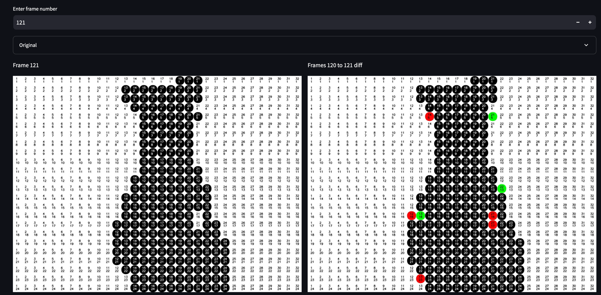

# Badapple-irl

Final video:

## Introduction

The idea behind this project was to downsample the Bad Apple!! video into circles, so that I
could recreate the video in real life using actual (fake) apples. 

Below is a description of all the Python code that I wrote for this project, in the order that I wrote them in.
If you read all the descriptions, you get a solid idea of the sequence of events and the thought process behind
the project.

## downsample-video.py
This script was helping me decide on a downsampling resolution.

The original video is 960x720, and I played around with different downsampling resolutions.
For example, I tried binning every 20x20 square into a black or white circle, and the
video was still pretty crisp, however, I would need 960x720/(20x20) = 1728 apples for this, which
is not only expensive, but would take a prohibitively long time to move.

I started scouting for apples, and found some decent looking ones on Aliexpress. These
were 3cm in diameter, and the surface I planned to use was around 78cm wide, meaning I could
 fit 26 apples in a row. I found that dividing the original video into 30x30 squares of pixels to make a resolution of 
32x24 would be a good compromise, and the 24 fits nicely into the 26 rows I could do. 
This means I would only need to buy 768 apples, which is much more reasonable.

## max-apple-moves.py
Before buying the apples, I wanted to make sure that I could complete this project in a reasonable
timespan. To do this, I needed to calculate how many times I would have to move apples.
To calculate the maximum number of moves, I tracked how many pixels changed from white to black or black to white
between frames. This was basically just an exclusive or operation between the two frames' sets.

Using this method, I found that I would need at most 147688 moves. Assuming each move would take 1 second,
this equated to 2461 minutes, or 41 hours. This was a bit too long for me, so I wanted to check something else.

## min-apple-moves.py
I minimized the moves by including the fact that you could move apples from a formerly black spot to
a new black spot, thus not double counting some moves. Mathematically, this just meant that the moves between two frames
was the maximum of the white-to-black transitions and the black-to-white transitions. This reduced the number moves
down to 96351, which was a decent size decrease. At this point, I realized that using cartesian
coordinates to try and coordinate moves was probably dumb, and that it would be much faster
to just create "diffs", where I have an image that has additions in green and removals in red. This would
allow me to quickly memorize a few moves and remove them. Assuming that each move instead takes 1 second using this 
method, this gives 1605 minutes, 26.5 hours, or just over a day (or three days for a sane person). This is totally feasible! 

(narrator: it was not
totally feasible. It took over 50 days. 1 second per apple was way too ambitious, removals may be that fast but additions
take a long time, and you have to move around the canvas to place apples too. This whole project was just a chain of
underestimations followed by sunken cost fallacies, and it was so worth it)

## main.ipynb
This is the file I used to output frames, downsampled frames, and importantly, diff frames. It was easier to use a notebook so I could
repeat imports and reuse objects and code while running stuff separately. The images created are used in workflow.py.
At this point, I wanted to use the travelling salesman problem to optimize the order of apples moved in a single frame,
but this was too much effort and the result wasn't very good (but TSP makes a comeback later).

## workflow.py
Streamlit web-app that lets me go through the frames and see the diffs easily on the TV while
I moved the apples. Streamlit is such a good tool
for making quick GUIs like this. The picture at the top of the Readme is an image of this workflow.

## find_duplicate_frames.py
I thought it would be useful to tell me on the TV if a frame I was doing was a duplicate, that way I would know for sure
that I didn't have to move any apples. This wasn't that useful, but it may have saved me a bit of mental effort
scanning all the frames with my eyes.

## frame_rate_test.py
After doing 364 frames, I decided it was way too much work to do all 6000+ frames and I cut the framerate a bit. This 
script let me test out which framerate was reasonable and still looked good. I decided on 15 fps I believe.

## travelling-salesman.ipynb
At some point I decided to try and optimize the number of apple moves I would need to do by using the travelling salesman
problem (TSP) solutions to find the optimal frame order. These notebooks have that process, and they are really messy,
so I'm sorry if you wanted to read them. This created an optimized frame order which I used for the last 3104 frames.
I'm not sure why I made two files, maybe the second one was more focused on TSP.

<-- 100s of hours of work -->

## compare_frames.py
Another streamlit app, this one let me compare the frames I was supposed to take with the frames I actually took.
If the two frames matched, and then I skipped forward 100 frames and they didn't match, I knew that I was missing 
a frame or had too many frames, and that the problem was somewhere in those 100 frames. This helped me delete 
duplicate frames and find missing frames that I had to retake.

## auto_white_balance.py and backtick_to_click.py
These were for automating some of the tedious parts of working in lightroom while postprocessing the frames. 
They basically let me place the mouse over a part of the pictures, and then it would go through all of them and set
the white balance using that part of the picture.

## bad-apple-videomaker.py
File that creates a video out of all the post-processed frames. Makes a 30 fps video
for the first part (before TSP) and 15fps for the TSP part. Also makes a video with the file names, 
because I thought it would be a cool aesthetic. 